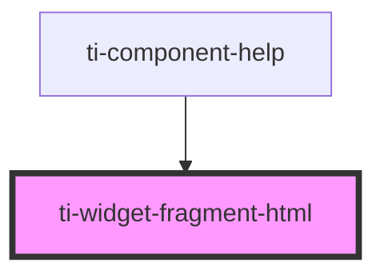

# ti-widget-fragment-html

<!-- Auto Generated Below -->

## Properties

| Property  | Attribute | Description                                             | Type      | Default |
| --------- | --------- | ------------------------------------------------------- | --------- | ------- |
| `hidden`  | `hidden`  | Sets to `true` to hide the element, otherwise `false`.  | `boolean` | `false` |
| `text`    | `text`    | HTML fragment string to input to the div.               | `string`  | `''`    |
| `tooltip` | `tooltip` | Controls the tooltip that is displayed for this widget. | `string`  | `''`    |

## Events

| Event                  | Description                                                                   | Type               |
| ---------------------- | ----------------------------------------------------------------------------- | ------------------ |
| `css-property-changed` | Event `css-property-changed`, with `detail: { name: string, value: string }`. | `CustomEvent<any>` |

## Methods

### `fire(eventName: string, detail: object) => Promise<void>`

Fire an widget event.

#### Returns

Type: `Promise<void>`

### `getCSSProperty(name: string) => Promise<string>`

Returns the value of a CSS property.

#### Returns

Type: `Promise<string>`

### `refresh() => Promise<void>`

Refresh the element.

#### Returns

Type: `Promise<void>`

### `setCSSProperty(name: string, value: string) => Promise<void>`

Sets the CSS property.

#### Returns

Type: `Promise<void>`

## Dependencies

### Used by

 - [ti-component-help](../ti-component-help)

### Graph

----------------------------------------------

*Built with [StencilJS](https://stenciljs.com/)*
