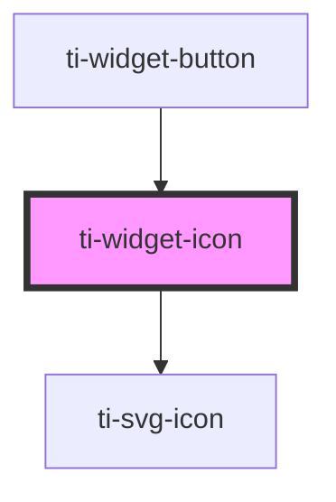

# ti-widget-icon

<!-- Auto Generated Below -->

## Properties

| Property     | Attribute    | Description                                                                                                                                                                                                                                                                                                  | Type                                                                                                 | Default                 |
| ------------ | ------------ | ------------------------------------------------------------------------------------------------------------------------------------------------------------------------------------------------------------------------------------------------------------------------------------------------------------ | ---------------------------------------------------------------------------------------------------- | ----------------------- |
| `appearance` | `appearance` | Icon appearance, can be one of the following: `primary`, `secondary`, `tertiary`, `success`, `warn`, `error`, `reversed`, or `custom`. Also, `reversed` can be added as in `primary reversed`. This inverts the foreground and background colors. And `custom` can be added as to provide custom fill style. | `"custom" \| "error" \| "primary" \| "reversed" \| "secondary" \| "success" \| "tertiary" \| "warn"` | `'tertiary'`            |
| `circle`     | `circle`     | Place the icon in a circle wrapper.                                                                                                                                                                                                                                                                          | `boolean`                                                                                            | `false`                 |
| `hidden`     | `hidden`     | Sets to `true` to hide the element, otherwise `false`.                                                                                                                                                                                                                                                       | `boolean`                                                                                            | `false`                 |
| `icon`       | `icon`       | The icon to be displayed (svgFilename:iconName e.g. objects:info-circle)                                                                                                                                                                                                                                     | `string`                                                                                             | `'objects:info-circle'` |
| `path`       | `path`       | Path to the icon folder.                                                                                                                                                                                                                                                                                     | `string`                                                                                             | `undefined`             |
| `size`       | `size`       | Icon size - one of `s` (18x18), `m` (24x24), `l` (36x36), or `xl` (48x48).                                                                                                                                                                                                                                   | `"l" \| "m" \| "s" \| "xl"`                                                                          | `'m'`                   |
| `tooltip`    | `tooltip`    | Controls the tooltip that is displayed for this widget.                                                                                                                                                                                                                                                      | `string`                                                                                             | `''`                    |

## Events

| Event                  | Description                                                                   | Type               |
| ---------------------- | ----------------------------------------------------------------------------- | ------------------ |
| `css-property-changed` | Event `css-property-changed`, with `detail: { name: string, value: string }`. | `CustomEvent<any>` |

## Methods

### `fire(eventName: string, detail: object) => Promise<void>`

Fire an widget event.

#### Returns

Type: `Promise<void>`

### `getCSSProperty(name: string) => Promise<string>`

Returns the value of a CSS property.

#### Returns

Type: `Promise<string>`

### `refresh() => Promise<void>`

Refresh the element.

#### Returns

Type: `Promise<void>`

### `setCSSProperty(name: string, value: string) => Promise<void>`

Sets the CSS property.

#### Returns

Type: `Promise<void>`

## Dependencies

### Used by

 - [ti-widget-button](../ti-widget-button)

### Depends on

- ti-svg-icon

### Graph

----------------------------------------------

*Built with [StencilJS](https://stenciljs.com/)*
