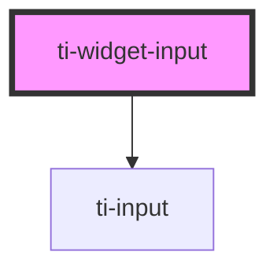

# ti-widget-input

<!-- Auto Generated Below -->

## Properties

| Property              | Attribute              | Description                                                                                                                                                                                                                                                                                                                                            | Type                                                   | Default     |
| --------------------- | ---------------------- | ------------------------------------------------------------------------------------------------------------------------------------------------------------------------------------------------------------------------------------------------------------------------------------------------------------------------------------------------------ | ------------------------------------------------------ | ----------- |
| `caption`             | `caption`              | The widget caption text.                                                                                                                                                                                                                                                                                                                               | `string`                                               | `''`        |
| `disabled`            | `disabled`             | Controls the widget disabled state.                                                                                                                                                                                                                                                                                                                    | `boolean`                                              | `false`     |
| `format`              | `format`               | The display format type.                                                                                                                                                                                                                                                                                                                               | `"binary" \| "dec" \| "exp" \| "hex" \| "q" \| "text"` | `'text'`    |
| `hidden`              | `hidden`               | Sets to `true` to hide the element, otherwise `false`.                                                                                                                                                                                                                                                                                                 | `boolean`                                              | `false`     |
| `infoText`            | `info-text`            | The widget info icon help text.                                                                                                                                                                                                                                                                                                                        | `string`                                               | `''`        |
| `intermediateChanges` | `intermediate-changes` | Controls whether or not intermediate changes due to the user's mouse dragging or typing are committed to the value attribute. If intermediate changes are not allowed, then the value attribute will only update when the user has finished dragging or entering text.                                                                                 | `boolean`                                              | `false`     |
| `placeholder`         | `placeholder`          | Placeholder text when input is empty.                                                                                                                                                                                                                                                                                                                  | `string`                                               | `undefined` |
| `precision`           | `precision`            | The display format precision, only valid for numeric format type.    `binary` minimum digits with zero extended.  `dec` number of decimal places to round to.  `exp` number of decimal places to round to.  `hex` minimum digits with zero extended.  `q` the number of bits used to designate the fractional portion of the number. | `number`                                               | `undefined` |
| `readonly`            | `readonly`             | Controls the widget readonly state.                                                                                                                                                                                                                                                                                                                    | `boolean`                                              | `false`     |
| `tooltip`             | `tooltip`              | Controls the tooltip that is displayed for this widget.                                                                                                                                                                                                                                                                                                | `string`                                               | `''`        |
| `value`               | `value`                | The input value.                                                                                                                                                                                                                                                                                                                                       | `number \| string`                                     | `undefined` |

## Events

| Event                  | Description                                                                   | Type                                 |
| ---------------------- | ----------------------------------------------------------------------------- | ------------------------------------ |
| `css-property-changed` | Event `css-property-changed`, with `detail: { name: string, value: string }`. | `CustomEvent<any>`                   |
| `value-changed`        | Fired when the `value` property changed.                                      | `CustomEvent<{ value: ValueType; }>` |

## Methods

### `fire(eventName: string, detail: object) => Promise<void>`

Fire an widget event.

#### Returns

Type: `Promise<void>`

### `getCSSProperty(name: string) => Promise<string>`

Returns the value of a CSS property.

#### Returns

Type: `Promise<string>`

### `refresh() => Promise<void>`

Refresh the element.

#### Returns

Type: `Promise<void>`

### `setCSSProperty(name: string, value: string) => Promise<void>`

Sets the CSS property.

#### Returns

Type: `Promise<void>`

## Dependencies

### Depends on

- ti-input

### Graph

----------------------------------------------

*Built with [StencilJS](https://stenciljs.com/)*
