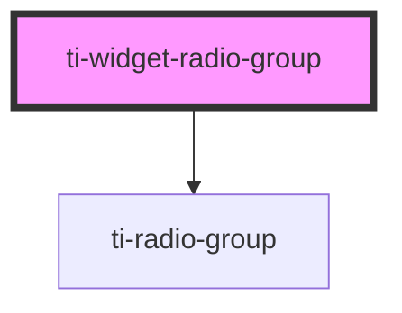

# ti-widget-radio-group

<!-- Auto Generated Below -->

## Properties

| Property        | Attribute        | Description                                                                   | Type               | Default     |
| --------------- | ---------------- | ----------------------------------------------------------------------------- | ------------------ | ----------- |
| `caption`       | `caption`        | The widget caption text.                                                      | `string`           | `''`        |
| `disabled`      | `disabled`       | Controls the widget disabled state.                                           | `boolean`          | `false`     |
| `hidden`        | `hidden`         | Sets to `true` to hide the element, otherwise `false`.                        | `boolean`          | `false`     |
| `horizontal`    | `horizontal`     | If true, set the layout of the radio control to horizontal, default is false. | `boolean`          | `false`     |
| `infoText`      | `info-text`      | The widget info icon help text.                                               | `string`           | `''`        |
| `initialIndex`  | `initial-index`  | The index of the option to be initially selected by default.                  | `number`           | `undefined` |
| `selectedIndex` | `selected-index` | The zero-based index of the selected option.                                  | `number`           | `undefined` |
| `selectedText`  | `selected-text`  | The label text of the selected option.                                        | `string`           | `undefined` |
| `selectedValue` | `selected-value` | The value represented by the selected option.                                 | `number \| string` | `undefined` |
| `tooltip`       | `tooltip`        | Controls the tooltip that is displayed for this widget.                       | `string`           | `''`        |

## Events

| Event                    | Description                                                                   | Type                                        |
| ------------------------ | ----------------------------------------------------------------------------- | ------------------------------------------- |
| `css-property-changed`   | Event `css-property-changed`, with `detail: { name: string, value: string }`. | `CustomEvent<any>`                          |
| `selected-index-changed` | Fired when teh `selectedIndex` property changed.                              | `CustomEvent<{ value: number; }>`           |
| `selected-text-changed`  | Fired when the `selectedText` property changed.                               | `CustomEvent<{ value: string; }>`           |
| `selected-value-changed` | Fired when the `selectedValue` property changed.                              | `CustomEvent<{ value: string \| number; }>` |

## Methods

### `fire(eventName: string, detail: object) => Promise<void>`

Fire an widget event.

#### Returns

Type: `Promise<void>`

### `getCSSProperty(name: string) => Promise<string>`

Returns the value of a CSS property.

#### Returns

Type: `Promise<string>`

### `refresh() => Promise<void>`

Refresh the element.

#### Returns

Type: `Promise<void>`

### `setCSSProperty(name: string, value: string) => Promise<void>`

Sets the CSS property.

#### Returns

Type: `Promise<void>`

## Dependencies

### Depends on

- ti-radio-group

### Graph

----------------------------------------------

*Built with [StencilJS](https://stenciljs.com/)*
